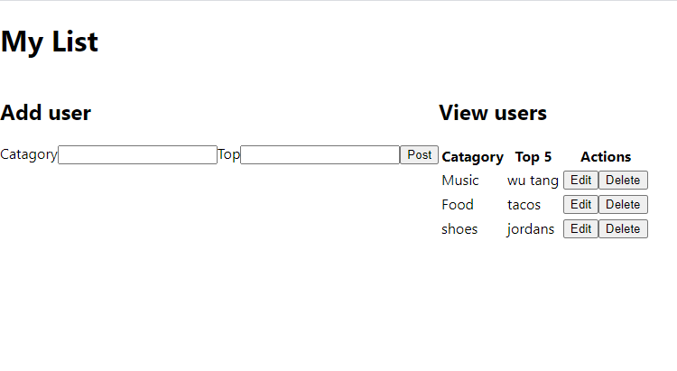

# List app
    
#Created on 10/26/2020

# By Brandon Perez

# Screen Shot

## Table of Contents
* [Description](#Description)
* [Installation](#Installation)
* [Knoun-bugs](#Known-bugs)
* [Technologies-Used](#Technologies-Used)
* [Contribution](#Contribution)
* [License](License)

## Description 
This application allows users to create personilzed list based on categories The user sets.
    
## Installation
1-git clone, 2- npm ,3- npm start
    
## Known bugs
Currently the back end has not been fully connected to the front end.
    
## Contact Information
brandonp940@gmail.com
    
## Technologies Used 
React, JavaScript, Node.js, Mongoose, CSS, HTML
    
## Contribution

    
### License
MIT

